# Design pass: editorial purple / silver

Before and after, rendered from the theme's own CSS in Chromium at 1440px and
390px. Images are placeholder blocks in both captures, so what changes here is
type, colour, material and composition — not photography.

## The whole page

<table>
<tr><th width="50%">Before</th><th width="50%">After</th></tr>
<tr>
<td valign="top">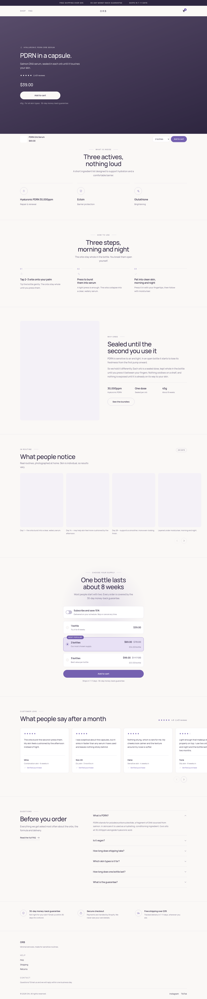</td>
<td valign="top">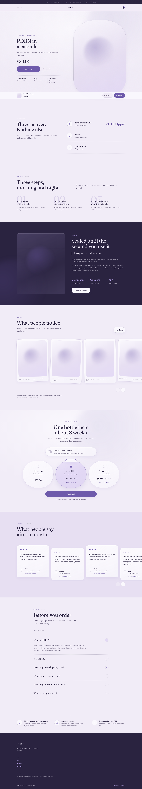</td>
</tr>
</table>

Read them as two vertical rhythms. Before: nine sections on one near-white
ground, eight of them a centred heading over evenly spaced content, every
surface the same value. After: light, light, **dark**, light, wash, pearl,
light, **plum** — the page has a spine, and the eye has somewhere to rest.

### Mobile

<table>
<tr><th width="50%">Before</th><th width="50%">After</th></tr>
<tr>
<td valign="top">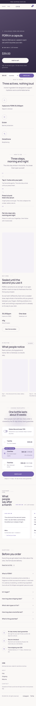</td>
<td valign="top">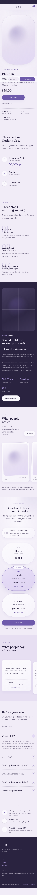</td>
</tr>
</table>

---

## What changed, section by section

### Foundations

| | Before | After |
| --- | --- | --- |
| Page | `#FAF8F6` — reads as white | `#F1ECF7` lilac-pearl + 3% generated grain |
| Cards | `#FFFFFF` | `#FAF8FD` pearl, silver gradient edge, inner top highlight, soft violet halo |
| Ink | `#2E2640` | `#2A2340` plum |
| Accent | `#7561B0` | `#6E5AAB`, plus `#635099` for violet **text** |
| Type | Manrope for everything | Fraunces 400 display + Manrope 400/500 body |
| Section padding | 96 / 56 | 112 / 64 |
| Content width | 1240px | 1180px |

**Why it's better:** the single biggest tell of a template is one flat
near-white ground with boxes on it. Three values of pearl, a grain texture and a
drifting orb give the page material. And Manrope alone is too even — a page set
in one humanist sans at three sizes reads as a default. The serif/sans pairing
is what makes a headline look art-directed rather than styled.

**Silver is a material now, not a pale grey.** Every rule on the page is a
gradient that fades at both ends and catches the light in the middle
(`--silver-line`), and every ring, tag and frame edge is a gradient border drawn
in the border box with the fill in the padding box, so the metal follows the
curve. That is the difference between "a 1px grey line" and brushed metal, and
it is what lets silver hold its own against the purple instead of disappearing
into it.

**Depth is a violet halo, never a grey drop shadow.** This is the single change
that moves the page from architectural to skincare. Reading the reference
page's CSS, its depth is `0 16px 40px rgba(150,130,200,.22)` — coloured, wide,
low-opacity — and its surfaces carry soft diagonal gradients rather than flat
fills. Both are now tokens here: `--shadow-soft` / `--shadow-lift` scaled by a
**Glow** setting, and a `--sheen` gradient across every card fill. Set Glow to
0 and the page returns to completely flat.

**Numbers are now editorial.** `30,000ppm`, `$34.50/bottle`, `28 days`, `01/02/03`
are set in Fraunces, larger than the text beside them. Data is the most
persuasive content on a supplement-adjacent page; it should not look like body
copy.

### Hero

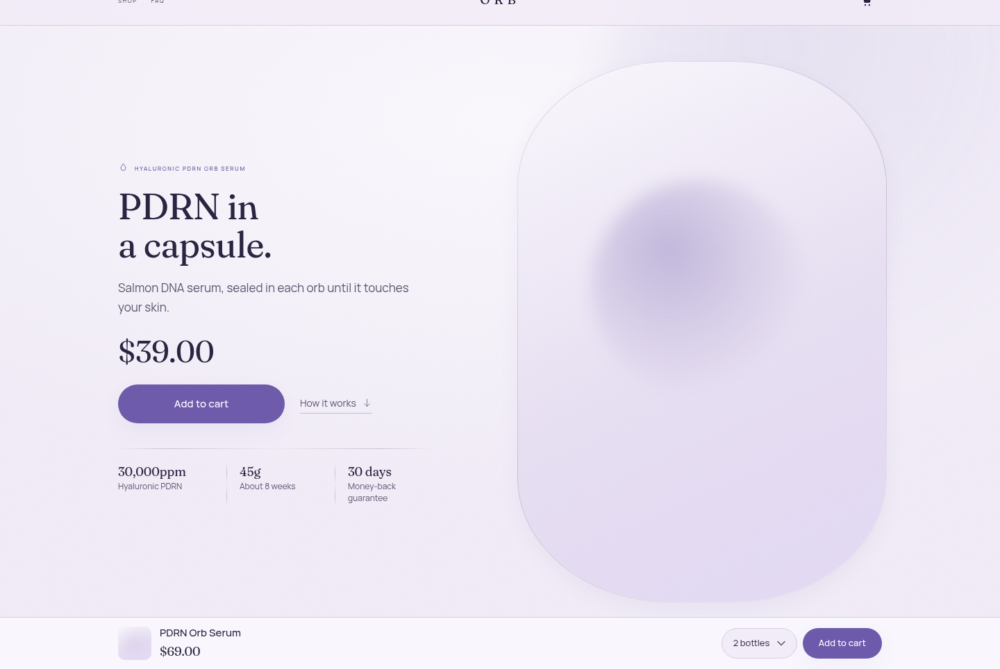

Before: full-bleed dark video, copy centred-left over a scrim, everything
stacked down the middle at one measure.

After: asymmetric. Copy left, media right in a tall pill mask with a silver
hairline, running past the right edge of the viewport. 72px Fraunces headline
(40px mobile). One pill CTA, with **How it works ↓** beside it as a text link
rather than a competing second button. Beneath, a thin silver rule and three
micro-stats — 30,000ppm, 45g, 30 days.

**Why it's better:** the old hero answered "what is this" and nothing else. The
stat rule answers "is it strong enough, how long does it last, what if I hate
it" before any scrolling. The bleed and the off-centre grid are what stop it
reading as a stock hero block.

### Ingredients

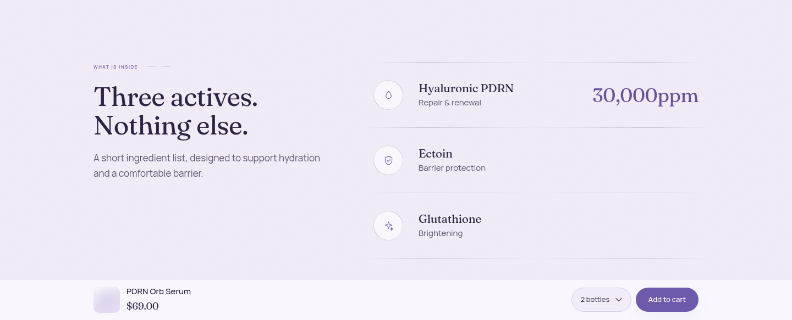

Before: three bordered cards in a row under a centred heading — the single most
recognisable Shopify pattern there is.

After: a two-column editorial spread. Left, the claim at display size — *Three
actives. Nothing else.* Right, three hairline-separated rows, each a silver
icon ring, the ingredient in Fraunces, a one-line benefit in Manrope, and the
ppm figure set large in violet at the end of the row.

**Why it's better:** it reads as a specification, not a feature grid. And it
puts 30,000ppm where the eye lands.

On hover the row tints, its silver ring warms and scales, and the figure shifts
2px — enough to confirm the row is a unit, not enough to make a static list feel
like a menu.

### How it works

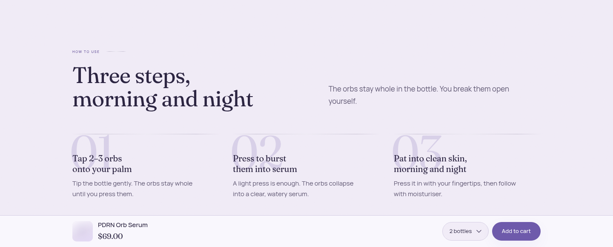

Before: three columns, small `01 02 03` labels above each title.

After: oversized Fraunces numerals sitting *behind* the copy at 18% violet, like
magazine folios, with the heading and lede split across an asymmetric two-column
header.

**Why it's better:** the sequence is now felt rather than read, and the copy
stays first in the reading order.

### Why encapsulated

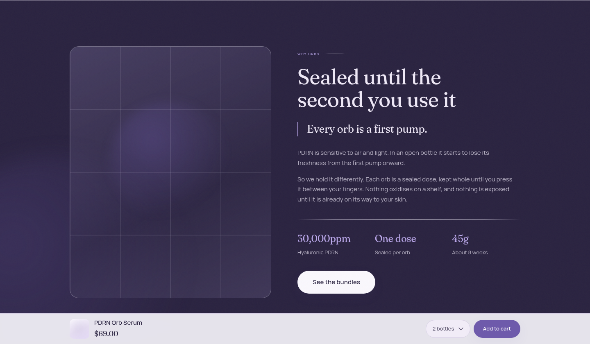

Before: image left, copy right, on the same near-white as everything above it.

After: the one dark section — plum ground, pearl text, media behind a silver
hairline grid, a pull quote in Fraunces (*"Every orb is a first pump."*), stats
in light violet, and a blurred orb bleeding in from the bottom-left.

**Why it's better:** this is the argument section — the reason the product costs
$39 rather than $12. Giving it the page's only inversion makes it land, and it
breaks up what was an unrelieved run of pale sections.

### Results gallery

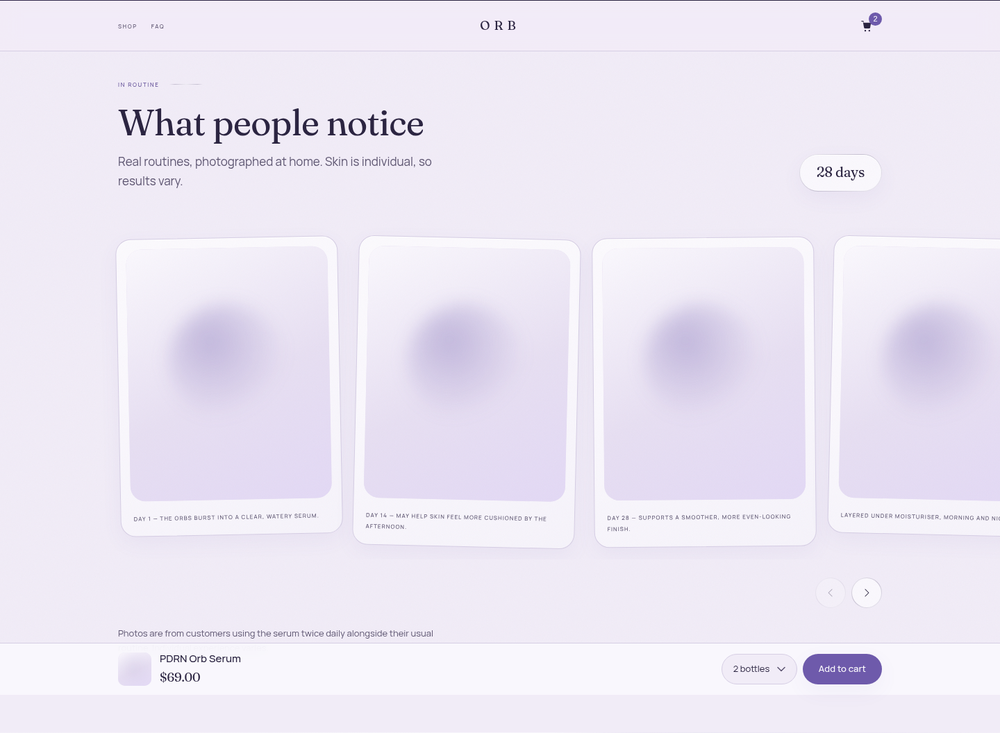

Before: a plain scroll row of rounded rectangles, captions in sentence case.

After: each shot sits in a pearl frame tilted about a degree, alternating
direction, straightening on hover. Captions in letter-spaced small caps. The
"28 days" badge is a pearl pill with the figure in Fraunces.

**Why it's better:** prints laid on a table, not a filmstrip. The rotation is
small enough to read as craft rather than as a gimmick, and it's removed
entirely under reduced motion.

### Bundle selector

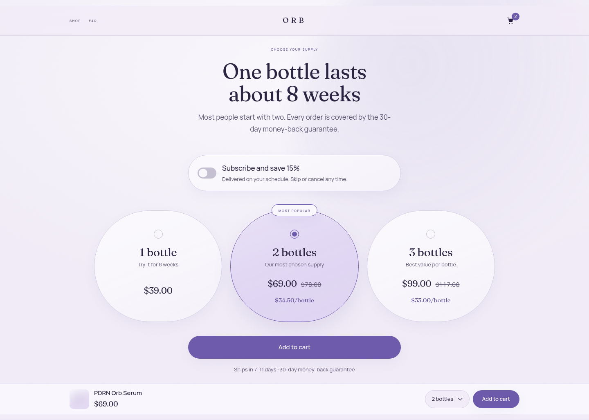

Before: three stacked horizontal rows, "Most popular" notching the card border.

After: three tall pill cards side by side on a pearl-to-lilac radial wash with
an orb behind them. "Most popular" is a silver tag sitting astride the card's
top edge. Selection animates the ring from silver to violet and tints the card.
Per-bottle price in Fraunces violet.

**Why it's better:** the offer is the most important block on the page and now
looks like the most designed one. Three vertical cards also make the price
ladder comparable at a glance, which stacked rows do not.

Hover lifts the card 4px and widens its halo; the marker ring scales and turns
violet. Selecting is the same gesture, held.

### Reviews

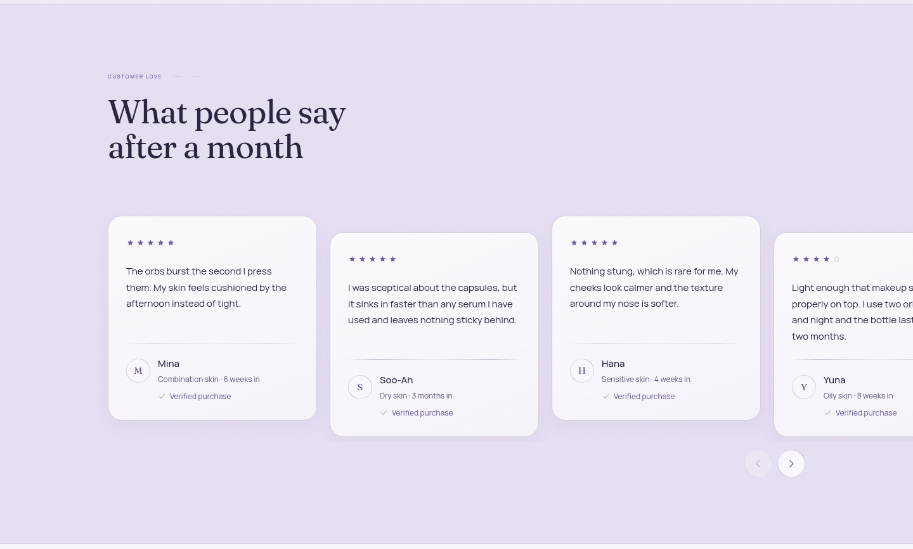

Before: white cards on white, flush in a row.

After: pearl cards on a deeper lilac band, alternating 26px vertical offset, a
hairline ring with the reviewer's initial instead of an avatar.

**Why it's better:** the band separates the section without a divider, and the
stagger stops four identical cards reading as a table.

### FAQ

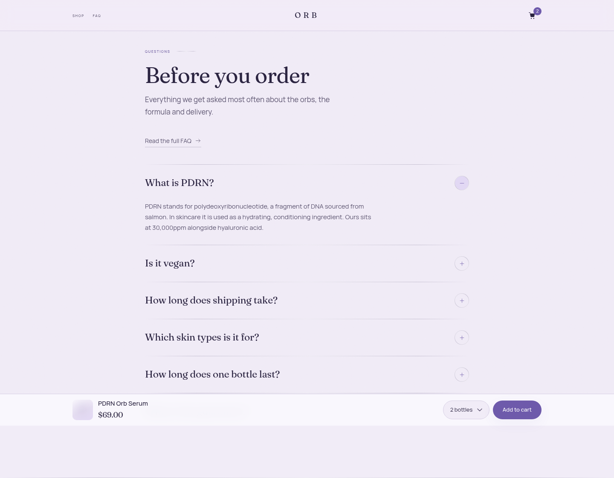

Before: two columns, sans questions, chevron markers.

After: one 760px column, questions in Fraunces, a silver ring that swaps plus
for minus and fills violet when open.

**Why it's better:** a two-column FAQ makes you look left-right-left to read.
One column is simply easier, and the serif questions carry the brand into a
section that is usually the most generic part of any store.

### Footer

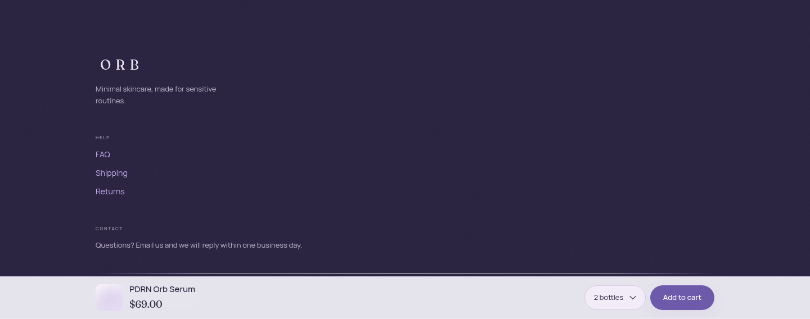

Before: hairline-topped, same ground as the page, grey links.

After: plum, letter-spaced Fraunces wordmark, pearl text, light-violet links.

**Why it's better:** the page now closes on the same dark note it turned on in
the clinic section, so the palette feels deliberate rather than decorative.

---

## Motion

Everything below is off entirely under `prefers-reduced-motion: reduce`,
verified by rendering the page in that mode and reading the computed styles.

| | What happens |
| --- | --- |
| On load | Hero eyebrow, headline, lede, price and stats rise 14px and fade in over 520ms, staggered 80ms apart |
| On scroll | Sections fade and rise 18px with a slight scale, 900ms on an expo-out curve. Siblings inside one parent are staggered 90ms apart by index, set in JS, so a row of three cascades instead of popping |
| Hero media | Drifts slower than the page — a rAF-throttled parallax clamped to ±48px so nothing detaches from its column |
| Buttons | 2px lift, halo widens, 240ms; press returns it to 0 |
| Cards (bundle, review, results) | 4px lift and a wider halo; results frames also straighten from their tilt |
| Rings (ingredients, FAQ, guarantee) | Scale 1.06 with a soft halo |
| Images | 1.2s drift to 1.03 inside their frame |
| FAQ | Panel unrolls 6px over 420ms; the marker swaps plus for minus and fills violet |

Every lift is a token (`--lift-y`, `--lift-y-sm`, `--lift-scale`) rather than a
literal in each rule, so reduced motion zeroes all of them from one place. That
was not cosmetic: the first pass patched hover resets rule by rule and the
bundle card still lifted under reduced motion — the render caught it.

## Where I overrode the brief

**1. A separate ink for violet text.** The brief set one accent, `#6E5AAB`. It
passes AA on the page ground (4.87:1) and carries white button text fine
(5.66:1) — but violet *text* on the tinted fills failed: the per-bottle price on
a selected card measured **4.18:1** and the reviews eyebrow on the pearl band
**4.37:1**, against a 4.5 bar. Rather than lighten the fills or drop the violet,
there is now a second token, **Accent — text `#635099`**, used for eyebrows,
figures and unit prices. Worst case across all four surfaces is 4.94:1. The
accent itself is unchanged and still carries every fill, ring and button.

**2. Review rating and count default to empty — and the whole summary hides
with them.** The brief asked for empty defaults. Rendering `☆☆☆☆☆` with no
number beside it looks broken and implies zero reviews, so the star row and
summary are suppressed entirely until a count is entered, in the hero, the
product hero and the reviews section.

**3. Micro-stats are separated by hairlines, not dots.** The brief's `·`
separators orphan a floating dot at the start of a line whenever the row wraps —
which it does at 1440px with three stats. They are now grid cells with hairline
left borders, which cannot orphan.

**4. The "no drop shadows" rule is retired, deliberately.** The earlier brief
banned them and the first pass honoured it — hairlines and tints only. That is
what made the page read as architectural rather than dewy. Following the
reference page's own depth language, cards and buttons now carry a soft violet
halo. It is not a grey drop shadow: the colour is the accent, the blur is wide
and the opacity is low. The **Glow** setting scales it, and 0 restores the
previous flat look exactly.

**5. Grain sits under the header, not over it.** The grain overlay is fixed at
`z-index: 2`; the sticky header is at 20. Texturing a translucent blurred
header over scrolling content produced visible banding, and the header already
has its own material from the backdrop blur.

**6. `.section--deep a` had to exclude buttons.** Not a brief override so much
as a bug the render caught: the dark-section link colour was winning over
`.button--light`, painting "See the bundles" light violet on a pearl fill at
roughly 2:1. Scoped to `a:not(.button)`.

Nothing here was overridden for conversion reasons. The one thing I'd watch:
the pill-shaped bundle cards spend vertical space on their round ends, so the
price sits lower than in a rectangular card. I reserved a fixed line for the
per-bottle price so all three prices share a baseline; if it ever tests worse
than the old rows, the shape is one `border-radius` value away from changing.

---

## Checks

| Check | Result |
| --- | --- |
| `shopify theme check` | **52 files, 0 errors**, 2 warnings (both the Google Fonts `<link>`) |
| Contrast, measured on the rendered page | **0 failures** across every distinct text/background pairing, AA thresholds (4.5 normal, 3.0 large) |
| No `#FFFFFF` backgrounds | 0 elements |
| Drop shadows | None grey; depth is violet halos derived from the accent, scaled by the Glow setting |
| Hover states | Every interactive surface verified to move: bundle card, button, ingredient row, results frame, review card, FAQ marker, carousel arrow (the disabled arrow correctly stays put) |
| Reduced motion | Reveals shown, orb still, parallax 0, every hover lift 0 — verified in `reducedMotion: 'reduce'` |
| Horizontal overflow at 390px | none — document width 390 = viewport width |

Contrast was measured from the DOM: every element with its own text node,
sampling its computed colour against its nearest opaque ancestor background,
classified large vs normal by rendered pixel size and weight. That is what
caught the two violet-on-tint failures above — both looked fine.

Hover was measured the same way: move the mouse to each element and diff its
computed style against rest. Worth noting for anyone re-running it —
`el.matches(':hover')` returns false in this headless build even when the hover
styles are plainly applied, so the computed style is the only trustworthy
signal. A control case confirmed that before I trusted any of the results.

## Not verified

Rendered in Chromium only, from a static page that mirrors the section markup
with placeholder imagery — there is no store to run `shopify theme dev` against.
Fraunces and Manrope were served locally for the captures because the sandbox
cannot reach Google Fonts; the theme loads them from Google in the normal way.
Real photography will change how much the pearl frames and pill masks carry, and
Lighthouse still needs a live store to be worth quoting.
